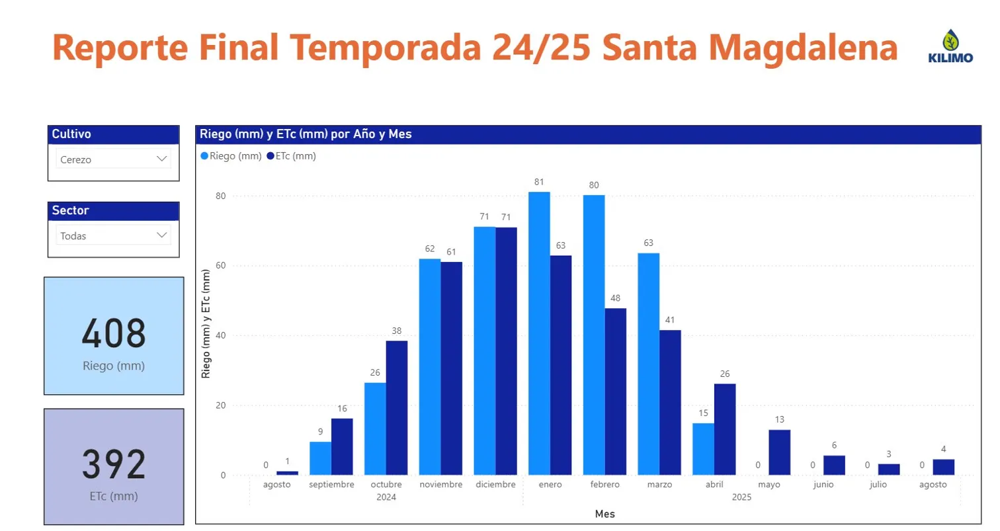
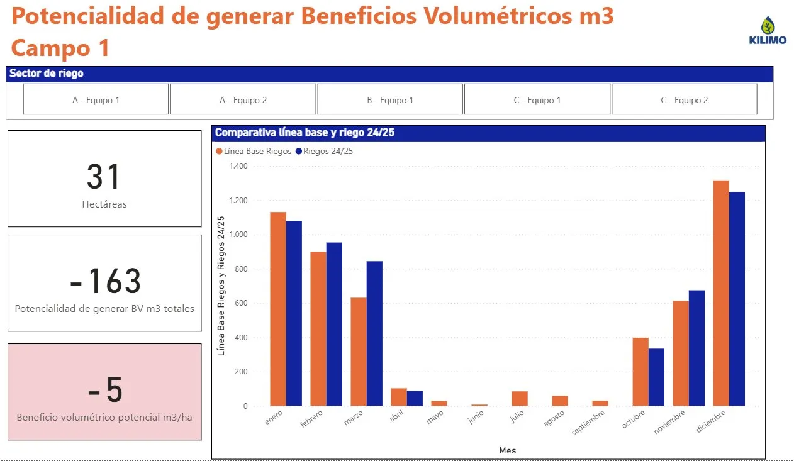
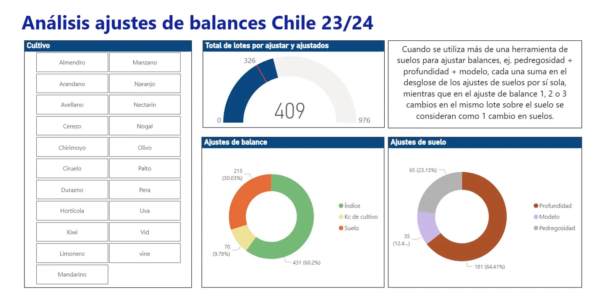

# Data Analytics Portfolio · Pía González

**Herramientas:** SQLite · DBeaver · Google Colab · Python (pandas) · Power BI

Repositorio con proyectos de análisis de datos que cubren el ciclo completo: configuración de bases de datos relacionales, limpieza y transformación de datos con Python, análisis con SQL y visualización en Power BI.

---

## Proyectos SQL

### 📦 [01 · Producción Agrícola por Estado (EE.UU.)](./01_agricultural_production/)
Análisis de producción de productos lácteos, miel y café por estado. Incluye joins entre múltiples tablas, filtros por año, identificación de estados sin producción y comparaciones entre commodities.

**Conceptos:** `JOIN`, `LEFT JOIN`, `subqueries`, `GROUP BY`, `WHERE`, `NOT IN`

---

### 🛒 [02 · Análisis de Plataforma E-commerce](./02_ecommerce_analysis/)
Análisis de comportamiento de usuarios, órdenes y eventos en una plataforma de comercio electrónico. Incluye análisis de series de tiempo con date spine, manejo de nulos y métricas de negocio.

**Conceptos:** `COALESCE`, `date spine`, `LEFT JOIN`, `GROUP BY`, `CASE WHEN`, `subqueries`

---

## Dashboards Power BI

Dashboards desarrollados en **Kilimo** (plataforma SaaS de riego de precisión), integrando datos agronómicos, climáticos y de suelo para apoyar decisiones de riego a escala de cultivo y campo. Datos de clientes anonimizados.

---

### 📊 Dashboard 1 · Reporte Final de Temporada



Compara riego aplicado (mm) vs. evapotranspiración del cultivo (ETc, mm) mes a mes. Filtros interactivos por cultivo y sector, KPIs de temporada y gráfico de barras agrupadas con doble serie temporal.

---

### 💧 Dashboard 2 · Beneficios Volumétricos por Sector



Compara la línea base histórica de riegos vs. la temporada actual para cuantificar el ahorro de agua (m³) por sector y hectárea. Aplicado en reportes de sostenibilidad y certificaciones de eficiencia hídrica.

---

### 🌱 Dashboard 3 · Análisis de Ajustes de Balance



Monitoreo operativo de ajustes a balances hídricos por cultivo (21 especies), clasificados por tipo de ajuste (Índice, Kc, Suelo) y parámetro de suelo (Profundidad, Modelo, Pedregosidad).

---

## Estructura del repositorio

```
data-analytics-portfolio/
├── 01_agricultural_production/
│   ├── README.md
│   ├── queries/
│   │   ├── 01_setup.sql
│   │   ├── 02_basic_queries.sql
│   │   ├── 03_joins.sql
│   │   └── 04_subqueries.sql
│   └── data/
│       └── setup_instructions.md
├── 02_ecommerce_analysis/
│   ├── README.md
│   ├── queries/
│   │   ├── 01_setup.sql
│   │   ├── 02_exploratory.sql
│   │   ├── 03_aggregations.sql
│   │   ├── 04_date_spine.sql
│   │   └── 05_subqueries.sql
│   └── data/
│       └── setup_instructions.md
├── preview1.webp   ← Dashboard: Reporte Final de Temporada
├── preview2.webp   ← Dashboard: Beneficios Volumétricos
├── preview3.webp   ← Dashboard: Ajustes de Balance
└── README.md
```

---

*Contacto: [LinkedIn](https://linkedin.com/in/piagonzalezbrowne) · pia.gonzalez@email.com*
